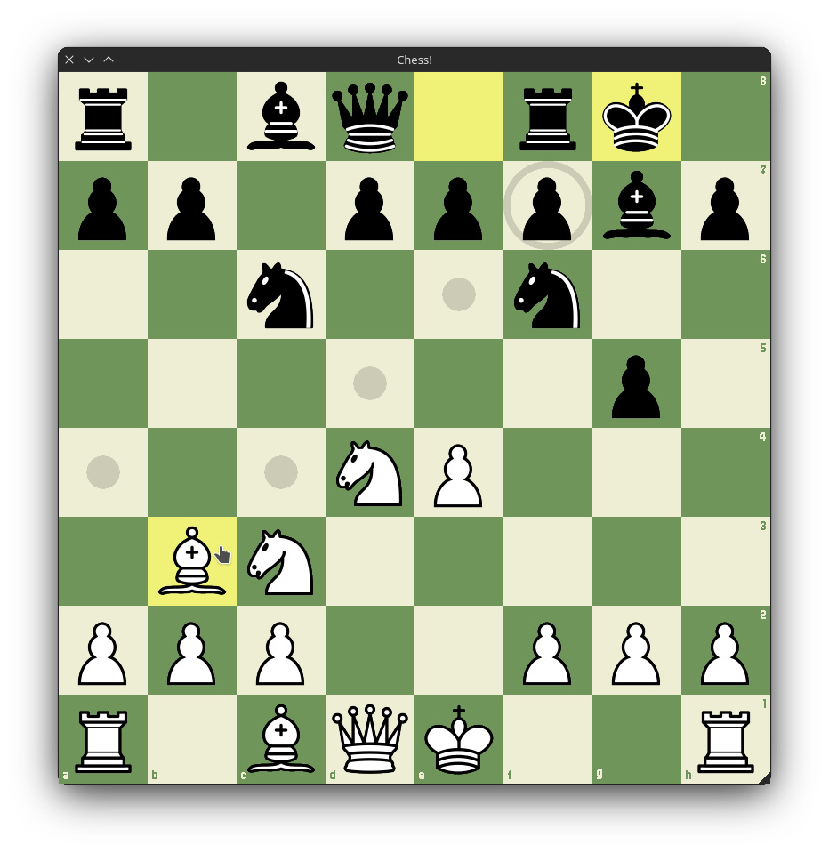

# SFML Chess!

Fully functional game of chess written in C++ and SFML (2.5.1).

Controls are simple - press a square and drag a piece or press on another square to move.
LeftArrow to undo a move, RightArrow to redo.



Build it yourself:

1. Install dependencies:
    * Arch Linux:
       ```shell
       sudo pacman -S cmake sfml nlohmann-json
       ``` 
    * Debian / Ubuntu:
      ```shell
      sudo apt-get install cmake libsfml-dev nlohmann-json3-dev
      ```

2. Build project and run:

```shell
bash -c "git clone https://github.com/matihope/Chess.git && \
    cd Chess && \
    cmake -B build && \
    cd build && \
    make && \
    cd ../bin && \
    ./chess"
```

**It's important to note, that to launch the game, you have to be inside the bin folder.**

List of attributions:

* [SFML](https://github.com/SFML/SFML)
* [nlohmann json](https://github.com/nlohmann/json)
* [Wikimedia chess pieces](https://commons.wikimedia.org/wiki/Category:SVG_chess_pieces)
* Born2bSportyV2 font. Unluckily, I can't find it anywhere on the internet anymore. 
